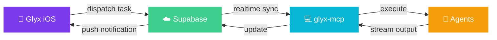

<div align="center">

<br/>

```
   ██████╗ ██╗  ██╗   ██╗██╗  ██╗
  ██╔════╝ ██║  ╚██╗ ██╔╝╚██╗██╔╝
  ██║  ███╗██║   ╚████╔╝  ╚███╔╝
  ██║   ██║██║    ╚██╔╝   ██╔██╗
  ╚██████╔╝██████╗ ██║   ██╔╝ ██╗
   ╚═════╝ ╚═════╝ ╚═╝   ╚═╝  ╚═╝
```

**Control AI coding agents from your phone.**

Run Claude Code, Cursor, Codex, and Aider on your dev machine — <br/>
stream output in real-time, get push notifications, approve actions on the go.

<br/>

[![][ios-badge]][ios-link]
[![][backend-badge]][backend-link]
[![][web-badge]][web-link]

<br/>

[![][ci-badge]][ci-link]
[![][deploy-badge]][deploy-link]
![Python 3.11+][python-badge]
[![][license-badge]][license-link]

<br/>

[**Website**](https://glyx.ai) · [**iOS App**](https://github.com/glyx-ai/glyx-ios) · [**Issues**](https://github.com/glyx-ai/glyx-mcp/issues)

<br/>

</div>

## Quick start

```bash
curl -sL glyx.ai/pair | bash
```

That's it. The script installs dependencies, starts the executor, and shows a QR code. Scan it with the [Glyx iOS app](https://github.com/glyx-ai/glyx-ios) to pair your machine.

<details>
<summary><strong>What you'll see</strong></summary>
<br/>

The setup runs silently with animated spinners, then presents a Rich-powered pairing screen:

```
  ✓  uv
  ✓  Downloaded glyx
  ✓  Dependencies ready

  ╭──────────── Scan with Glyx iOS ────────────╮
  │                                             │
  │            ████████████████████              │
  │            ██   QR CODE    ██               │
  │            ████████████████████              │
  │                                             │
  ╰────── Point your camera at this code ───────╯

  Device   MacBook-Pro (you)
  IP       192.168.1.5:8000
  Agents   claude  cursor  codex  aider
```

Built with [Rich](https://github.com/Textualize/rich) + [segno](https://github.com/heuer/segno).

</details>

## How it works



1. You dispatch a task from the iOS app
2. The task lands in Supabase
3. Your local glyx-mcp executor picks it up and runs the agent
4. Output streams back to your phone in real-time
5. If the agent needs input, you get a push notification

## Features

| | Feature | Description |
|---|---------|-------------|
| 🚀 | **Agent dispatch** | Run Claude Code, Cursor, Codex, or Aider from your phone |
| ⚡ | **Real-time streaming** | See agent output as it happens via Supabase Realtime |
| 🤝 | **Human-in-the-loop** | Agents can ask you questions — respond inline with a countdown timer |
| 🔔 | **Push notifications** | Get notified when agents need input or finish via [Knock](https://knock.app) |
| 📱 | **QR pairing** | One scan to connect your phone to your machine |
| 🔐 | **Token provisioning** | iOS sends your auth session to the local server — no API keys on disk |
| 🔍 | **Auto-detection** | Discovers which agents you have installed |

## Architecture

This project serves two roles from one codebase:

### Cloud API — deployed to Google Cloud Run

REST API that the iOS app talks to. Handles auth, task management, HITL requests, webhooks, and serves the pairing script.

### Local executor — runs on your machine

Subscribes to Supabase Realtime, picks up tasks assigned to your device, and runs them using local coding agents.

### Auth flow

The local executor authenticates using **your** Supabase session — not a service role key. During QR pairing, the iOS app provisions tokens to your local server:

```
iOS scans QR → POST /api/auth/provision → ~/.glyx/session (0600)
```

Tokens auto-refresh every 50 minutes.

## Development

```bash
git clone https://github.com/glyx-ai/glyx-mcp.git && cd glyx-mcp
uv sync --extra dev
uv run task dev
```

<details>
<summary><strong>All task commands</strong></summary>

| Command | Description |
|---------|-------------|
| `uv run task dev` | Start dev server with hot reload |
| `uv run task test` | Run test suite |
| `uv run task lint` | Ruff check + format |
| `uv run task lint-fix` | Auto-fix lint issues |
| `uv run task docker-build` | Build production Docker image |

</details>

<details>
<summary><strong>Environment variables</strong></summary>

Copy `.env.example` → `.env`:

| Variable | Required | Description |
|----------|----------|-------------|
| `SUPABASE_URL` | Yes | Supabase project URL |
| `SUPABASE_ANON_KEY` | Yes | Supabase publishable key |
| `SUPABASE_SERVICE_ROLE_KEY` | Dev only | For local dev without iOS pairing |
| `KNOCK_API_KEY` | Optional | Push notifications via Knock |
| `LOGFIRE_TOKEN` | Optional | Observability via Logfire |

</details>

## Deployment

Pushing to `main` auto-deploys to Google Cloud Run via GitHub Actions + Terraform.

Infrastructure is defined in [`infra/`](infra/) (Terraform).

## Project structure

```
glyx-mcp/
├── src/
│   ├── api/                  # FastAPI server + REST routes
│   │   ├── routes/           # Auth, tasks, HITL, devices, pair
│   │   ├── webhooks/         # GitHub + Linear handlers
│   │   ├── session.py        # Token provisioning
│   │   ├── local_executor.py # Realtime task executor
│   │   └── server.py         # Combined FastAPI + FastMCP
│   ├── glyx_mcp/             # MCP protocol server
│   └── python-sdk/           # Glyx Python SDK + agent configs
├── scripts/                  # Pairing display, dev tools
├── infra/                    # Terraform (GCP)
├── supabase/                 # Database migrations
└── tests/                    # pytest suite
```

## Ecosystem

| | Project | Description |
|---|---------|-------------|
| 📱 | [**glyx-ios**](https://github.com/glyx-ai/glyx-ios) | iOS app — Swift/SwiftUI |
| ☁️ | **glyx-mcp** | Backend + local executor — Python/FastAPI *(this repo)* |
| 🌐 | [**glyx**](https://github.com/glyx-ai/glyx) | Web app — Next.js at [glyx.ai](https://glyx.ai) |

## License

[MIT](LICENSE)

<!-- Badge references -->
[ios-badge]: https://img.shields.io/static/v1?label=&message=iOS%20App&color=7C3AED&style=flat-square&logo=apple&logoColor=white
[ios-link]: https://github.com/glyx-ai/glyx-ios
[backend-badge]: https://img.shields.io/static/v1?label=&message=Backend&color=06B6D4&style=flat-square&logo=google-cloud&logoColor=white
[backend-link]: https://github.com/glyx-ai/glyx-mcp
[web-badge]: https://img.shields.io/static/v1?label=&message=glyx.ai&color=10B981&style=flat-square&logo=vercel&logoColor=white
[web-link]: https://glyx.ai
[ci-badge]: https://img.shields.io/github/actions/workflow/status/glyx-ai/glyx-mcp/ci.yml?branch=main&style=flat-square&label=CI
[ci-link]: https://github.com/glyx-ai/glyx-mcp/actions/workflows/ci.yml
[deploy-badge]: https://img.shields.io/github/actions/workflow/status/glyx-ai/glyx-mcp/deploy.yml?branch=main&style=flat-square&label=Deploy
[deploy-link]: https://github.com/glyx-ai/glyx-mcp/actions/workflows/deploy.yml
[python-badge]: https://img.shields.io/badge/python-3.11+-3776AB?style=flat-square&logo=python&logoColor=white
[license-badge]: https://img.shields.io/badge/license-MIT-green?style=flat-square
[license-link]: https://github.com/glyx-ai/glyx-mcp/blob/main/LICENSE
