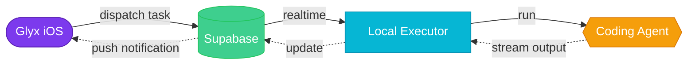

<div align="center">
<a name="readme-top"></a>

<br/>

<h1>
<picture>
  <source media="(prefers-color-scheme: dark)" srcset="https://img.shields.io/badge/GLYX-MCP-7C3AED?style=for-the-badge&labelColor=black&logoColor=white">
  
</picture>
</h1>

<em>Control AI coding agents from your phone.</em><br/><br/>
Run <b>Claude Code</b>, <b>Cursor</b>, <b>Codex</b>, and <b>Aider</b> on your dev machine —<br/>
stream output in real-time, get push notifications, approve actions on the go.

<br/><br/>

[![][ci-shield]][ci-link]
[![][deploy-shield]][deploy-link]
[![][python-shield]][python-link]
[![][license-shield]][license-link]

<br/>

[Website](https://glyx.ai) · [iOS App](https://github.com/glyx-ai/glyx-ios) · [Issues](https://github.com/glyx-ai/glyx-mcp/issues)

</div>

<br/>

## Quick start

```bash
curl -sL glyx.ai/pair | bash
```

That's it. The script installs dependencies, starts the local executor, and displays a QR code.
Scan it with the [Glyx iOS app](https://github.com/glyx-ai/glyx-ios) to pair your machine.

<details>
<summary><kbd>What you'll see</kbd></summary>
<br/>

Setup runs silently with animated spinners, then presents a [Rich](https://github.com/Textualize/rich)-powered pairing screen:

```
  ✓  uv
  ✓  Downloaded glyx
  ✓  Dependencies ready

  ╭──────────── Scan with Glyx iOS ────────────╮
  │                                             │
  │            ████████████████████              │
  │            ██   QR CODE    ██               │
  │            ████████████████████              │
  │                                             │
  ╰────── Point your camera at this code ───────╯

  Device   dev-machine (you)
  IP       192.168.1.5:8000
  Agents   claude  cursor  codex  aider
```

QR codes rendered with [segno](https://github.com/heuer/segno) in compact unicode half-blocks.

</details>

<br/>

## How it works



1. Dispatch a task from the Glyx iOS app
2. Task lands in Supabase
3. Your local executor picks it up and runs the coding agent
4. Output streams back to your phone in real-time
5. If the agent needs approval, you get a push notification

> [!NOTE]
> The local executor authenticates with **your** Supabase session tokens — not a service role key.
> During QR pairing, the iOS app provisions tokens to `~/.glyx/session` (mode `0600`).
> Tokens auto-refresh every 50 minutes.

<br/>

## Features

- **Agent dispatch** — Run Claude Code, Cursor, Codex, or Aider from your phone
- **Real-time streaming** — Watch agent output as it happens via Supabase Realtime
- **Human-in-the-loop** — Agents ask you questions, you respond inline with a countdown timer
- **Push notifications** — Get notified when agents need input or complete via [Knock](https://knock.app)
- **QR pairing** — One scan to connect your phone to your dev machine
- **Token provisioning** — Secure auth without API keys on disk
- **Auto-detection** — Discovers installed agents automatically

<br/>

## Architecture

This project serves **two roles** from one codebase:

| Role | Runs on | What it does |
|------|---------|-------------|
| **Cloud API** | Google Cloud Run | REST API for the iOS app — auth, tasks, HITL, webhooks, pairing |
| **Local executor** | Your machine | Subscribes to Supabase Realtime, runs coding agents, streams output |

<details>
<summary><kbd>Project structure</kbd></summary>

```
glyx-mcp/
├── src/
│   ├── api/                  # FastAPI server
│   │   ├── routes/           # Auth, tasks, HITL, devices, pair
│   │   ├── webhooks/         # GitHub + Linear handlers
│   │   ├── session.py        # Token provisioning (Pydantic + enums)
│   │   ├── local_executor.py # Realtime task executor
│   │   └── server.py         # Combined FastAPI + FastMCP
│   ├── glyx_mcp/             # MCP protocol server + logging
│   └── python-sdk/           # Glyx Python SDK + agent configs
├── scripts/                  # Pairing display (Rich + segno)
├── infra/                    # Terraform (GCP)
├── supabase/                 # Database migrations
└── tests/                    # pytest suite
```

</details>

<br/>

## Development

```bash
git clone https://github.com/glyx-ai/glyx-mcp.git && cd glyx-mcp
uv sync --extra dev
uv run task dev
```

<details>
<summary><kbd>Commands</kbd></summary>

| Command | Description |
|---------|-------------|
| `uv run task dev` | Dev server with hot reload |
| `uv run task test` | Run tests |
| `uv run task lint` | Ruff check + format |
| `uv run task lint-fix` | Auto-fix lint issues |
| `uv run task docker-build` | Build production image |

</details>

<details>
<summary><kbd>Environment</kbd></summary>

Copy `.env.example` → `.env`:

| Variable | Required | Description |
|----------|----------|-------------|
| `SUPABASE_URL` | Yes | Supabase project URL |
| `SUPABASE_ANON_KEY` | Yes | Supabase publishable key |
| `SUPABASE_SERVICE_ROLE_KEY` | Dev only | Skip iOS pairing in local dev |
| `KNOCK_API_KEY` | Optional | Push notifications |
| `LOGFIRE_TOKEN` | Optional | Observability |

</details>

<br/>

## Deployment

Push to `main` auto-deploys to Google Cloud Run via GitHub Actions + [Terraform](infra/).

<br/>

## Ecosystem

| Repo | Stack |
|------|-------|
| [**glyx-ios**](https://github.com/glyx-ai/glyx-ios) | Swift · SwiftUI · iOS 17+ |
| **glyx-mcp** *(you are here)* | Python · FastAPI · Supabase |
| [**glyx**](https://github.com/glyx-ai/glyx) | Next.js · [glyx.ai](https://glyx.ai) |

<br/>

## License

[MIT](LICENSE)

<div align="right">

[![][back-to-top]](#readme-top)

</div>

<!-- Shields -->
[ci-shield]: https://img.shields.io/github/actions/workflow/status/glyx-ai/glyx-mcp/ci.yml?branch=main&style=flat-square&label=CI&labelColor=black&logo=githubactions&logoColor=white
[ci-link]: https://github.com/glyx-ai/glyx-mcp/actions/workflows/ci.yml
[deploy-shield]: https://img.shields.io/github/actions/workflow/status/glyx-ai/glyx-mcp/deploy.yml?branch=main&style=flat-square&label=deploy&labelColor=black&logo=google-cloud&logoColor=white
[deploy-link]: https://github.com/glyx-ai/glyx-mcp/actions/workflows/deploy.yml
[python-shield]: https://img.shields.io/badge/python-3.11+-3776AB?style=flat-square&labelColor=black&logo=python&logoColor=white
[python-link]: https://www.python.org
[license-shield]: https://img.shields.io/badge/license-MIT-10B981?style=flat-square&labelColor=black
[license-link]: https://github.com/glyx-ai/glyx-mcp/blob/main/LICENSE
[back-to-top]: https://img.shields.io/badge/-BACK_TO_TOP-7C3AED?style=flat-square&labelColor=black
